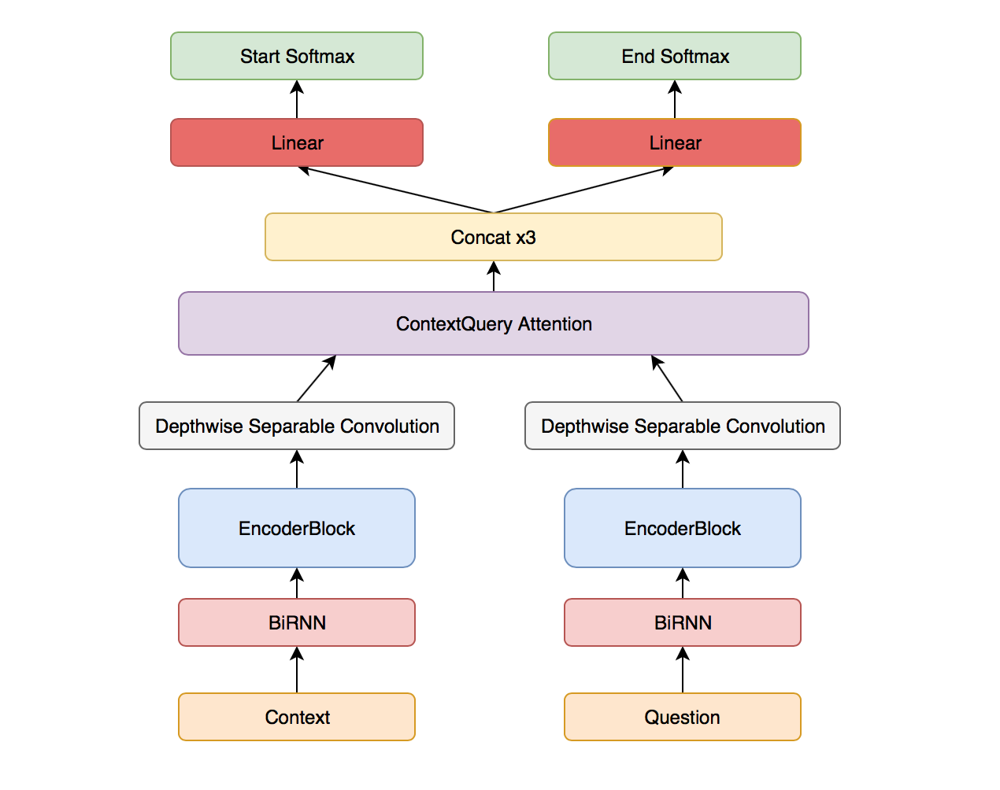
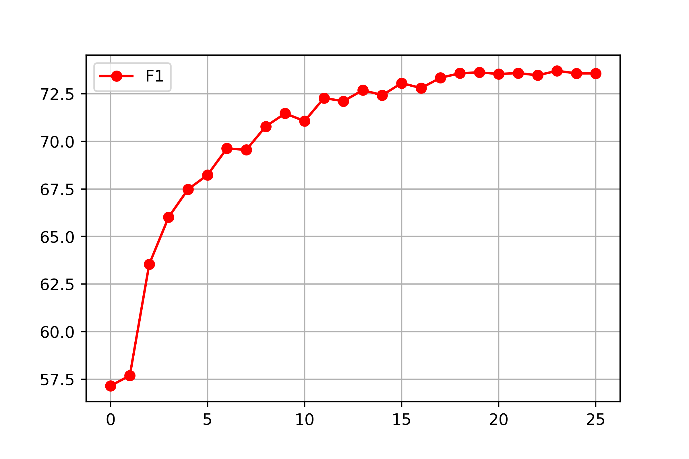
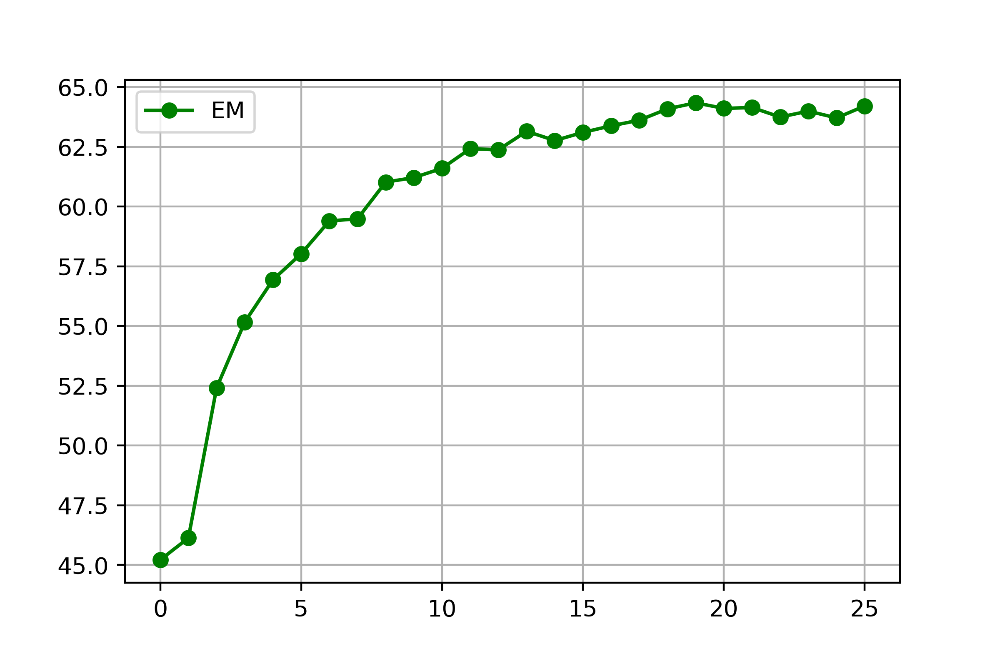

# SQuAD
A pytorch implementation of custom model for Stanford Question and Answering Dataset based on two papers [Reading Wikipedia to Answer Open-Domain Questions](http://www-cs.stanford.edu/people/danqi/papers/acl2017.pdf) and [QANet: Combining Local Convolution with Global Self-Attention for Reading Comprehension](https://arxiv.org/abs/1804.09541). 

## Model architecture


## Perfomance
Model was trained for 25 epochs which took 7 hours on one Nvidia Tesla P100

 

## Quick Start
### Requirements
	python >=3.5
	pytorch 0.4
	numpy
	msgpack
	spacy >=1.9
### Setup
Make sure that you installed python 3, pip, wget and unzip, [pytorch](http://pytorch.org/).

```bash
git clone https://github.com/MovElb/SQuAD
cd SQuAD
pip3 install -r requirements.txt
bash download.sh
```

### Training
As this implementation contains code from [DrQA](https://github.com/facebookresearch/DrQA), so by default mode training runs DrQA model. It can be trained by command

```
sudo python3 train.py -e 25 -bs 32
```

To run custom architecture add flag `--qanet_tail=True`, e.g.

```
sudo python3 train.py -e 25 -bs 32 --qanet_tail=True
```

### Evalutation
You can run model in interactive mode

```
sudo python3 interact.py
```

## Telegram bot
Install `telebot` pack for python3

```
python3 pip install pyTelegramBotAPI
```

To run telegram bot you need to train your model first, then edit telegram\_qanet_bot/config.py to change telegram bot token id. Then run it using command

```
sudo python3 bot.py --model_file=your_model_path
```
